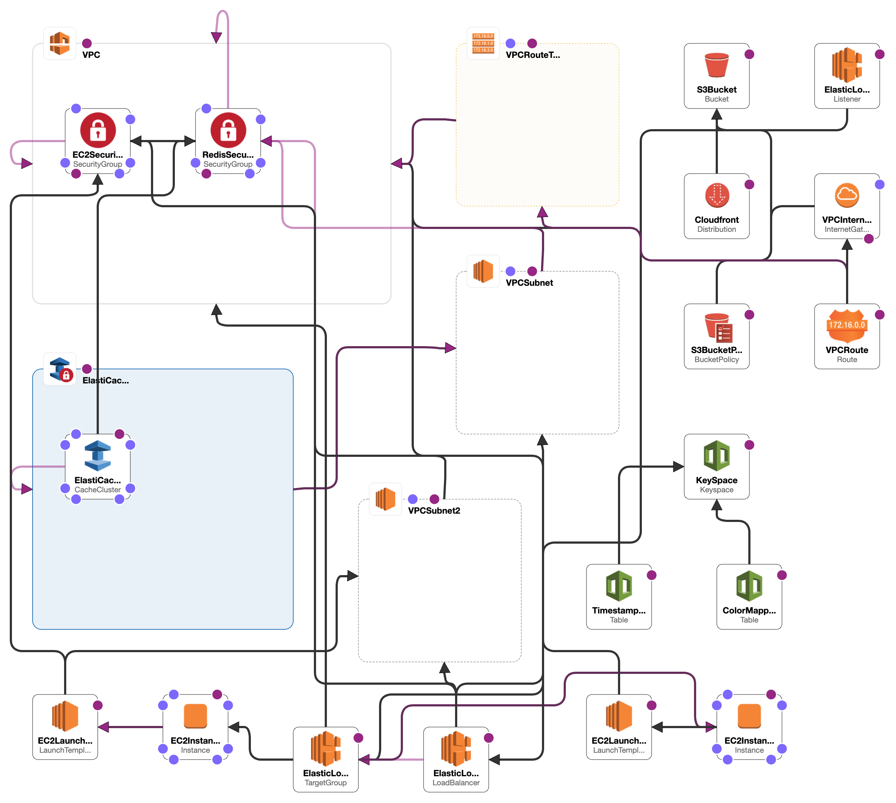

# r/Place

> r/Place using AWS services

## Table of Contents

- [Architecture](#architecture)
  - [Application Design](#application-design)
  - [AWS System Components](#aws-system-components)
  - [System Features](#system-features)
  - [Scalability](#scalability)
    - [Horizontal Scalability](#horizontal-scalability)
    - [Vertical Scalability](#vertical-scalability)
  - [System Limitations](#system-limitations)
- [Running The System](#running-the-system)
  - [Local Development](#local-development)
  - [AWS Deployment](#aws-deployment)

## Architecture



> Diagram of AWS services used in the system design

### Application Design

- **Canvas**: The canvas is stored as a bitmap for compactness. Users can choose from 16 colors when adding new pixels. As 4 bits is sufficient to represent 16 different colors, each tile only requires 4 bits to represent. A compact bitmap representation is useful for quick communication, particularly when sending the board to new users and retrieving the board from semi-persistent data.

- **Cache**: The bitmap of the board is stored in a Redis cache as a Redis bit field. Storing the bitmap within cache allows for quicker retrieval compared to storage in a traditional database.

- **Database**: A Cassandra database is used to store all data for the application. Each pixel is stored in a separate row. User updates are also stored alongside their timestamp to enable rate limiting.

- **Communication**: The initial board is sent as a bitmap when the client queries the `/api/board-bitmap` endpoint. Subsequent client updates are handled through persistent connections using WebSockets. The WebSocket API was chosen due to its lightweight nature and simplicity, as the base application functionality does not require advanced websocket features.

### AWS System Components

- **IAM**: IAM is used to create the roles and policies used during development of the system.

  - The user group `csc409a3` was created with three IAM users, one for each member of the group to use during development. This allowed access to the root account's resources to be regulated through permissions and policies.
  - The IAM user `former2` was created to utilize the 3rd party tool `former2` when generating the CloudFormation script. The tool views the services setup in the AWS account through the user to generate corresponding CloudFormation file. The user has read-only access to prevent privileged access.

- **EC2 Image Builder**: EC2 instances were created by launching a custom-made EC2 template. The EC2 image specified in the template was created using EC2 Image Builder. A cron job was created to start the application server on system startup, allowing the server to run automatically once the EC2 server is started. The cron job also monitors the status of the application server and restarts it if the server goes down.

- **Cloud Formation**: Cloud Formation is used to create the AWS resources required for the system. The Cloud Formation template is defined in the `cloud-formation.yml` file.

- **VPC**: The VPC is the virtual network that the system will run on. The VPC consists of two availability zones, `us-east-1a` and `us-east-1b`. Each availability zone contains a single subnet. Each EC2 instance containing an application server resides on a subnet.

- **EC2**: EC2 is used to run the application servers. A `t2.small` instance type was used to allocate sufficient resources for the application.

- **Elastic Load Balancing**: Elastic Load Balancing is used to distribute and forward traffic between the clients and application servers. A target group was defined for each availability zone in the VPC, each referring to the EC2 instances within the corresponding availability zone. Any r/place-related requests made from the client side are forwarded to one of the EC2 instances within the target groups.

- **ElasticCache**: ElasticCache was used to both cache the canvas and facilitate communication between the servers.

  - Storing the entire board in a Redis cache allows the board to be retrieved more quickly when requested by a client compared to a Cassandra database.
  - Using the Redis' publish and subscribe allows client updates to be broadcast across all servers, regardless of isolation. Broadcasting client updates is necessary for all clients to receive up-to-date information if multiple servers are present in the system, as each client is only connected to a single server through a websocket.

- **Keyspaces**: Keyspaces is used to store the canvas data and user actions. The replication strategy is set to Single Region, with 2 data centers in the us-east-1 region. The replication factor is set to 2, with 1 replica in each data center. The consistency level for writes set to Local Quorum, allowing for fast writes while ensuring that data is reliably stored on the nodes.

- **S3**: S3 is used to store the application static files, specifically the HTML and JavaScript files for the client side application. With this use case, the S3 bucket is configured to be public, allowing the files to be accessed from the public internet. The files are served to clients through CloudFront.

- **CloudFront**: CloudFront is used as the CDN for the application. The CloudFront distribution is configured to use the S3 bucket as the origin, allowing the files to be cached and served from the nearest edge location. Edge locations are configured to use North America and Europe, with the supported HTTP methods set to GET and HEAD. IPv6 is enabled for the distribution with the added support for HTTP/2.

### System Features

- **Intuitive UI**: The webpage has an intuitive UI that allows users to easily interact with the canvas and see real time updates from other users. Hovering over the canvas allows users to see the pixel coordinates. Clicking on the canvas allows users to update the input fields with the pixel coordinates. Users have a choice of 16 colors to choose from in the color dropdown.

- **Data Optimization**: The system stores and manipulates data using a `Uint8ClampedArray` which is a typed array that represents an array of 8-bit unsigned integers. This allows the system to keep track of 1 million rows of pixel data in a compact format and efficiently perform bitwise operations on the data when updating the canvas. As a result, the array size is reduced by a factor of 2, as each index in the 8-bit array represents 2 pixels on the canvas board, reducing the memory usage of the system.

- **Spam Protection**: The system tracks the timestamp of the last request made by a user using their IPv6 address. If a pixel update request is made within 5 minutes of the last request, the request is rejected. This check is performed on the server side to prevent users from bypassing the check by modifying the client side code. Although this restriction is enforced for spam protection, all users are still able to see real time updates from other users with the use of WebSockets.

- **Low Latency**: Utilizing CloudFront as our CDN for a global network of edge locations and Elastic Load Balancing to distribute traffic across multiple targets, the system is able to serve the application to users with low latency from the nearest edge location. The system is designed to be low latency, utilizing WebSockets to allow the application servers and users to broadcast updates in real time. The system is also designed to be low latency, utilizing ElasticCache to cache the canvas data and reduce the load on the database.

- **Availability**: The application servers are present in the us-east-1a (use1-az6) and us-east-1b (use1-az1) availability zones. Distributing the servers across availability zones increases the durability of the system. Area-wide failures can be contained within each availability zone.

- **Security**: Inbound rules are controlled using security groups. The minimal amount of ports required for functionality are allowed. The security group for the application servers only allows inbound traffic from the load balancer, so the database and cache are not exposed to the public internet.

- **Consistency**: We use the 'Local Quorum' consistency level for writes to our database, which requires a quorum of nodes in the local data center to respond. This strategy provides a good balance between consistency and performance, as it ensures that data is reliably stored on a majority of nodes, reducing the risk of data loss, while still allowing for relatively fast write operations. This is particularly beneficial in a distributed system like ours, where high availability and data durability are crucial.

### Scalability

#### Horizontal Scalability

- Usage of the publish/subscribe messaging system allows additional nodes to be added to the system without affecting functionality. The publish/subscribe model was necessary as client updates are handled through persistent WebSockets, which results in clients being associated to a specific server. The publish/subscribe model allows servers to propagate changes from other servers to their own clients.
- Load balancing is used to distribute traffic between the application servers. By having the load balancer as the main point of interaction between clients and application servers, additional application servers can be added without significantly altering the layout of the system.
- Additional availability zones could be added to reduce load on existing servers. This would also decrease latency for local clients.
- Increasing CloudFront's geographic coverage could increase initial transmission times for clients through caching.
- Additional load balancers or subnets could be added to support a larger number of connections. The existing system architecture can simply be duplicated.

#### Vertical Scalability

- EC2 instances can be configured with additional resources to improve performance for that server. The system currently uses `t2.small` instances for production.
- Storing data in a location external from the application server allows greater board sizes to be used if more resources are allocated to ElastiCache and Keyspaces. The servers themselves do not need to store much data.

### System Limitations

- **Cache Before Database**: Although the system caches the canvas data and only requires one database query for board data on startup, a weakness of our current system due to time constraints is that we check the database for the timestamp of the last user action, which results in an increased load on the database. To mitigate this, we should first check the cache for the timestamp before querying the database. If the timestamp is not in the cache, then we can query the database. This approach would reduce the load on the database and improve the performance of the system under higher load.

- **User Identification**: The system utilizes user IP addresses as unique identification during rate limiting. Usage of IP addresses as identification is not foolproof and it is possible for users to bypass their rate limit by utilizing different IP addresses for requests. Identification of users through IP addresses may also prevent user updates if multiple users share IP addresses. A more ideal solution would be to use account-based authentication.

- **Websocket Broadcasting**: The application server currently broadcasts updates to its clients by sequentially iterating through them. Broadcasts could be done in parallel to reduce update latency.

- **Cache Utilization**: The load on application servers would be reduced if clients queried the board from CloudFront instead of directly querying the servers through the `/api/get-board` endpoint. Doing so would limit the amount of traffic sent to the application servers. The current system can mitigate this issue by simply adding more servers, however.

- **Simplistic Architecture**: The current system architecture is minimalistic and additional components could be added to augment the system. For example, an API gateway could be utilized on top of the load balancer to enforce additional features such as security and monitoring.

- **Security**: The client must utilize a non-secure HTTP connection when interacting with the system. An HTTPS connection would better protect user data during transit.

## Running The System

### Local Development

> Caveat: Docker does not setup cassandra keyspace schema automatically. You will need to run the Cassadra image and the following command to setup the keyspace before running the application.

```bash
docker-compose up cassandra
docker exec -it cassandra cqlsh -f "/docker-entrypoint-initdb.d/schema.cql"
```

Make sure the javascript files inside the `static/` directory have devMode set to true.

Run the service locally to view the interface on `localhost:8080` with `make`.

```bash
$ make
✔ Container cassandra  Healthy
✔ Container redis      Healthy
✔ Container server     Started
$
```

### AWS Deployment

The system can be deployed by submitting the CloudFormation script to the CloudFormation service in AWS console.

Static files that are sent to the bucket must be added manually. The files can be found under the `static/` directory in the repository. The URL specified by the `domain` variable in the `url-builder.js` file must be adjusted to the public URL of the current load balancer and the `devMode` toggle must be false..

Clients may begin interacting with the system by going to the CloudFront URL and receiving the client side files necessary to update the canvas.
